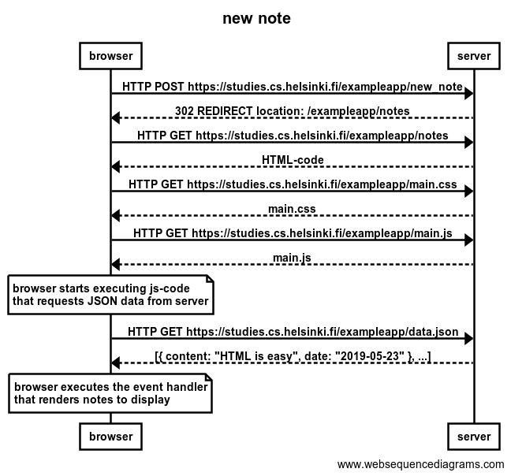
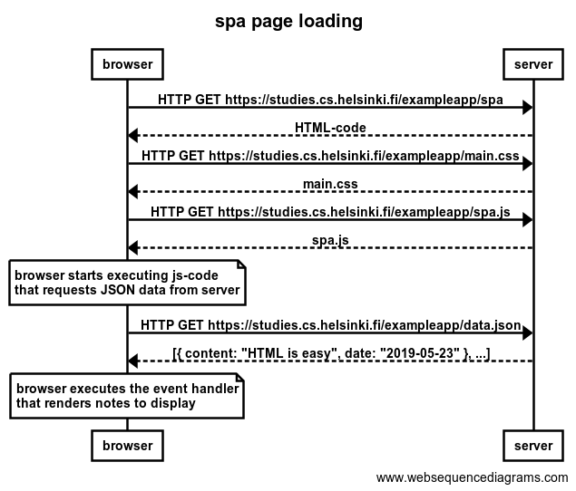
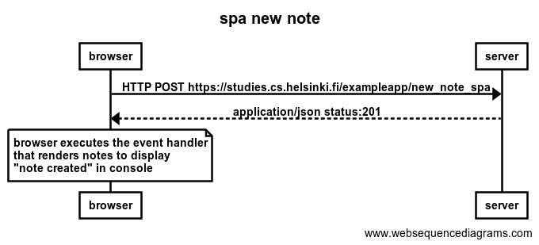

# Part0
[Course webpage](https://fullstackopen.com/en/part0)
- Exercise 4: sequence diagram when the user creates a new note on page https://studies.cs.helsinki.fi/exampleapp/notes by writing something into the text field and clicking the submit button. 

- Exercise 5: sequence diagram depicting the situation where the user goes to the single page app version of the notes app at https://studies.cs.helsinki.fi/exampleapp/spa. 

- Exercise 6: sequence diagram when user create new note on sigle page app https://studies.cs.helsinki.fi/exampleapp/spa. 